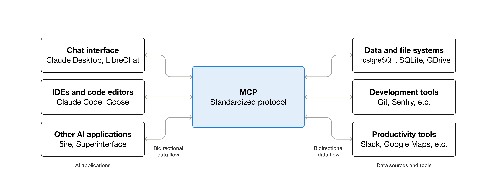
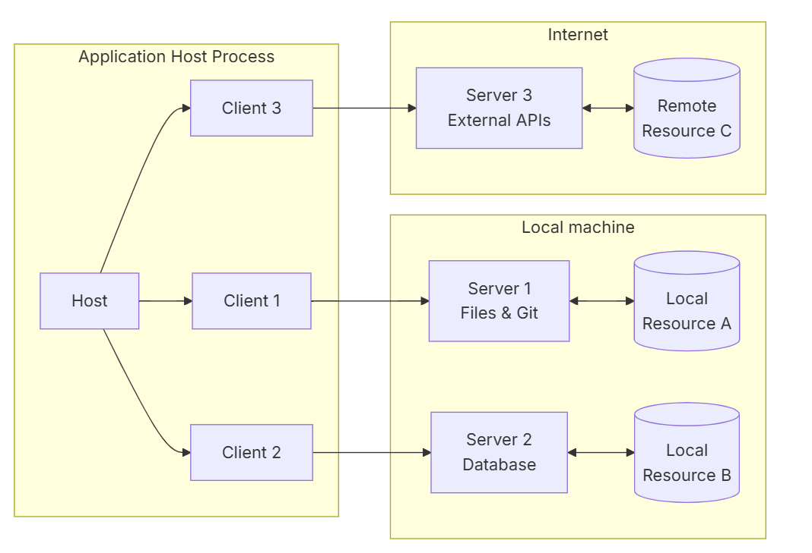
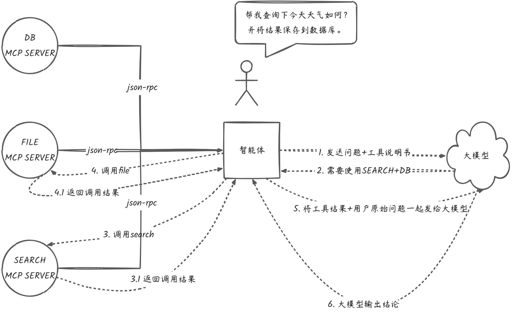

## 什么是 MCP

MCP，全称是 **Model Context Protocol（模型上下文协议）**。它由 Anthropic 开源，旨在解决大模型与外部世界"沟通不畅"的问题。

它不是一个具体的框架或技术，而是一个**通用开源标准协议**，用于安全、高效地连接智能体应用与外部工具。其核心理念是赋予智能体应用类似 **USB 接口**的能力：只需遵守统一的协议，就能标准化地调用各种外部工具，从而实现即插即用。

### 解决的问题

以前如果你想让大模型读取你的数据库，就必须为这个特定的智能体写一段专门的 **function call** 代码。换一个智能体，这段代码往往就得重新写一遍。

有了 MCP 之后，你只需要把数据库的一系列操作包装成一个 **MCP Server**。任何支持 MCP 的客户端（如 Claude Desktop、Cursor、Cline 等）都能直接连接这个 Server 使用工具，无需重复**造轮子**。

借助 MCP，工具都遵循统一的调用协议，智能体也能更加丝滑地与外部工具交互。

下面这张图来自 MCP 官网的架构图，可以直观地感受到 MCP 协议的"枢纽"作用：中间的 MCP 协议层作为统一标准，连接了左侧的智能体客户端（如 Claude、IDE）和右侧的工具（如数据库、文件系统等）。它把原本没有复用性的点对点连接，简化为统一的接口调用——只要支持 MCP 标准，左侧任意客户端应用都能**"即插即用"**地连接右侧任意工具，真正实现了智能体和工具的**功能解耦**。

## MCP 和 Function Call 有什么区别？

### Function Call 的痛点

在传统的 Function Call 模式中，整个流程本质上是一种**"硬编码式集成"**：每一次工具集成都是一次完整的开发，不可避免地要重复造轮子、形成强耦合，**所有环节都要由开发者自己实现**。

这些逻辑全部都必须在智能体内部"写死"。智能体数量一旦增加，每个智能体的接入代码都要重复书写；随着工具规模扩大，系统的耦合度越来越高，智能体的扩展成本也会急剧上升。

### MCP 如何解决这个问题

MCP 通过清晰的 **Client–Server 分层架构**解决了传统 Function Call "强耦合、难扩展、难管理"的问题。工具不再需要嵌入到智能体内部，而是以独立的 MCP Server 暴露能力；Client 负责通过 JSON-RPC 与 Server 进行能力协商与通信；智能体则统一管理权限、上下文整合与大模型的调用。这样一来，工具接入不再需要在智能体中硬编码逻辑，功能边界更清晰，智能体也能通过工具的组合与复用轻松扩展。

通俗来讲，Function Call 是**"智能体直接带着自制的工具去工作"**，而 MCP 则通过一套标准的协议与架构，把工具变成独立服务，由智能体统一调度——就像**"在工具商店，挑选专业制造商制造的工具去工作"**。智能体只需通过协议查询和调用，无需了解工具的内部实现即可直接使用，从而真正实现了工具的模块化、标准化和可插拔化。

## MCP 的工作流程

**第一阶段：初始化（工具说明获取）** 智能体初始化时，会通过 MCP 协议向所有连接的 MCP Server 使用 **JSON-RPC** 协议请求工具说明书。MCP Server 负责提供并确保这些说明书是**标准化的 JSON 格式**。

**第二阶段：决策（大模型规划）** 智能体将用户的原始问题和获取到的所有标准化工具说明一同发送给大模型。大模型根据这些信息进行规划，返回一个清晰的**工具调用指令**。

**第三阶段：调用（执行与结果回传）** 智能体接收到指令后，立即通过 **MCP 协议**请求对应的 MCP Server 执行工具操作。MCP Server 完成实际的工具逻辑（如数据库查询），并将**原始执行结果**返回给智能体。

**第四阶段：总结（生成最终回复）** 智能体将用户原始问题、工具执行的**最终结果**以及完整的对话历史，再次发回给大模型。大模型基于这些内容进行总结，生成一段自然语言回复输出给用户。

可以看到，**初始化**和**调用**这两个阶段都用到了 MCP 协议：初始化阶段，它通过标准化的 JSON-RPC 协议解决了工具说明书获取的问题，确保了说明书的可读性；调用阶段，MCP 协议则把大模型的指令转发给 Server 执行实际操作，确保了工具的执行逻辑。

## 工具调用的本质

通过上述流程，我们可以清晰地界定智能体与大模型的职责：**大模型**在工具调用中扮演的始终是**决策者**和**规划者**的角色，只负责输出调用哪个工具、传入什么参数的指令；工具调用的**实际执行者**其实是**智能体本身**（这部分逻辑智能体框架基本都已封装好）。智能体接收到大模型的决策指令后，才会去请求服务、执行操作并获取结果，大模型自身并不参与服务的实际调用。

不论是 Function Call 还是 MCP，它们在底层与大模型的交互本质上都要回到同一种能力：**向模型发送带有工具定义（schema）的对话请求，让模型基于这些标准化描述返回结构化指令**。把用户消息与工具说明一起发送给模型，模型就会根据工具说明生成 JSON 格式的函数调用参数。因此，从大模型的角度看，它始终只是在**读取你提供的工具说明书（schema），并给出"该调用哪个工具、参数是什么"的结构化结果**。

两者的区别只在于：**Function Call 需要由应用自行构造工具说明并封装工具实现逻辑，而 MCP 将工具说明与工具执行逻辑都封装成独立的外部服务**。
