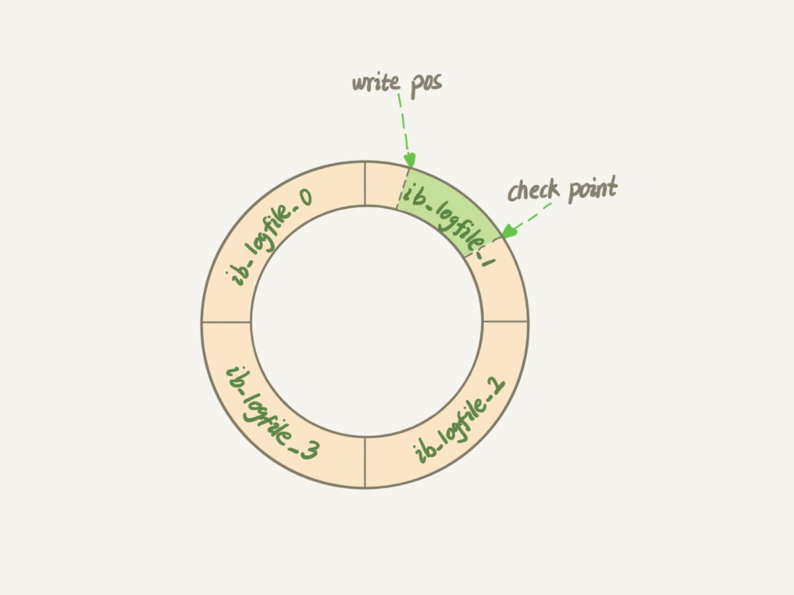
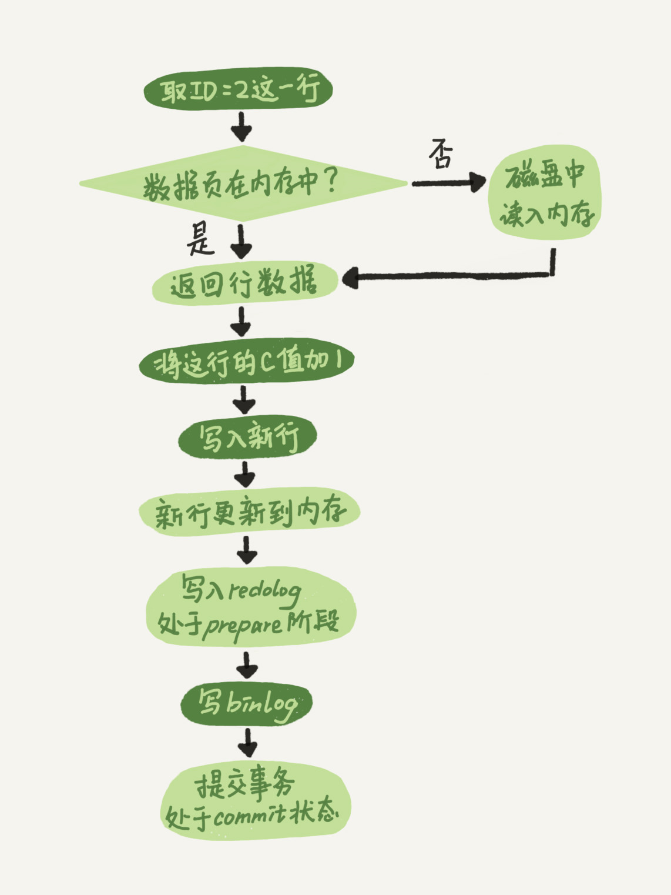

MySQL 中有三个核心日志：redo log、binlog 和 undo log。它们分属不同层次，承担不同职责——redo log 保证崩溃恢复，binlog 支撑数据归档与主从复制，undo log 实现事务回滚与 MVCC。

redo log 和 undo log 只适用于 InnoDB 存储引擎（因为要支持事务），binlog 则是 Server 层的日志，所有存储引擎都可以使用。

## redo log

如果每次更新操作都直接写磁盘，就需要先随机 IO 找到对应的数据页，再执行写入——IO 成本和查找成本都很高。

为了解决这个问题，InnoDB 采用了 WAL（Write-Ahead Logging）技术：先写日志，再写磁盘。当有记录需要更新时，InnoDB 引擎会先把操作写入 redo log 并更新内存，更新就此完成。磁盘的实际刷写会延迟到系统空闲时进行。

InnoDB 的 redo log 是固定大小的循环结构，可以配置为若干文件，例如 4 个 1 GB 的文件，总计 4 GB：

其中有两个关键指针：

- **write pos**：当前写入位置，向后移动，写满最后一个文件后回到 0 号文件开头。
- **checkpoint**：当前可擦除的位置，同样循环推移。擦除前需要先将记录刷入数据文件。

write pos 和 checkpoint 之间是可用空间。当 write pos 追上 checkpoint，说明日志写满了，必须先推进 checkpoint（将脏页刷盘）才能继续写入。

有了 redo log，即使数据库异常重启，已提交的事务也不会丢失，这就是 InnoDB 的 **crash-safe** 能力。

## binlog

MySQL 整体分为两层：Server 层负责 SQL 解析、优化、执行等功能；引擎层负责存储。redo log 是 InnoDB 引擎独有的，而 Server 层有自己的日志——**binlog**（归档日志）。

为什么会有两份日志？这是历史原因造成的。MySQL 最初自带的引擎是 MyISAM，MyISAM 没有 crash-safe 能力，binlog 仅能用于归档。InnoDB 是第三方以插件形式引入的，为了实现 crash-safe，才另立了一套 redo log。

redo log 和 binlog 有三点关键区别：

| 对比维度 | redo log | binlog |
|---------|---------|--------|
| 归属层次 | InnoDB 引擎特有 | Server 层，所有引擎通用 |
| 日志类型 | 物理日志，记录"某数据页做了什么修改" | 逻辑日志，记录语句的原始逻辑 |
| 写入方式 | 循环写，空间固定会用完 | 追加写，文件写满则新建，不覆盖历史 |

### update 语句的执行流程

以 `UPDATE t SET c = c + 1 WHERE ID = 2` 为例，执行器和 InnoDB 引擎的内部协作如下：

1. 执行器调用引擎接口，按主键找到 ID=2 这行数据。若数据页已在内存中直接返回，否则先从磁盘读入。
2. 执行器将字段 c 加 1，得到新数据，调用引擎写入接口。
3. 引擎将新数据写入内存，同时将操作记录到 redo log，此时 redo log 处于 **prepare** 状态。
4. 引擎通知执行器可以提交，执行器生成 binlog 并写入磁盘。
5. 执行器调用引擎的提交接口，引擎将 redo log 改为 **commit** 状态，更新完成。

### 两阶段提交

redo log 分 prepare 和 commit 两个阶段写入，是为了保证两份日志的逻辑一致性。

如果不用两阶段提交会有什么问题？以字段 c 从 0 改为 1 为例：

- **先写 redo log，再写 binlog**：redo log 写完后系统崩溃，重启后数据恢复为 1，但 binlog 里没有这条记录。用 binlog 恢复备库时，备库的 c 仍然是 0，主备不一致。
- **先写 binlog，再写 redo log**：binlog 写完后系统崩溃，redo log 未写，重启后事务回滚，主库 c 为 0。但 binlog 里已有"c 改为 1"的记录，用它恢复备库时备库 c 为 1，主备不一致。

两阶段提交的保证：崩溃恢复时，若 redo log 处于 prepare 状态且对应 binlog 完整，则提交事务；否则回滚。无论崩溃在哪个时刻，两份日志始终保持一致。

## undo log

undo log 是 InnoDB 实现**事务回滚**和 **MVCC（多版本并发控制）** 的基础。

### 事务回滚

每次对数据的修改，InnoDB 都会在 undo log 中记录对应的逆操作：

- INSERT → 记录对应的 DELETE
- DELETE → 记录对应的 INSERT
- UPDATE → 记录修改前的旧值

当事务需要回滚时，InnoDB 按 undo log 逆序执行这些操作，将数据还原到修改前的状态。

### MVCC

undo log 还为每行数据维护了一条版本链。每个事务修改数据时，旧版本不会立即被覆盖，而是通过 `roll_pointer` 指针串联成链表。配合事务的 **Read View**，不同事务可以读取到符合自己可见性要求的历史版本，而不互相阻塞——这就是 InnoDB 实现非锁定读的核心机制。

### undo log 的清理

undo log 不会永久保存。当一条记录对所有活跃事务都不再可见时，InnoDB 的 **purge 线程**会将其清理掉以释放空间。这也是长事务有害的原因之一：一个长时间运行的事务会阻止 purge 线程回收旧版本，导致 undo log 持续膨胀。

## 小结

| 日志 | 层次 | 主要职责 | 写入方式 |
|-----|------|---------|---------|
| redo log | InnoDB 引擎 | crash-safe，保证已提交事务不丢失 | 循环写，固定大小 |
| binlog | Server 层 | 数据归档、主从复制、时间点恢复 | 追加写，不限大小 |
| undo log | InnoDB 引擎 | 事务回滚、MVCC 多版本读 | 按需写，可被 purge 回收 |
