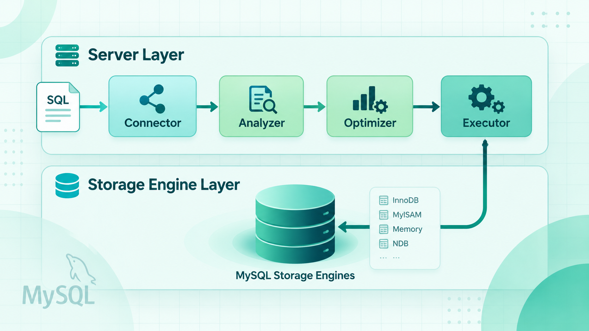
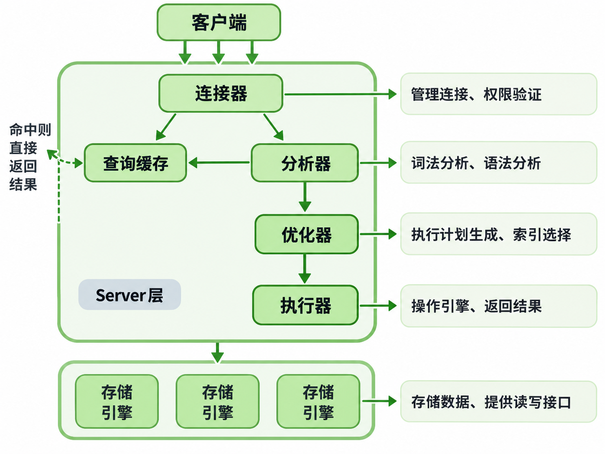

# MySQL 基础架构：一条 SQL 语句是如何执行的

很多人用 MySQL 很久了，却说不清楚一条查询语句从发出到返回结果，中间到底经历了什么。为什么改了用户权限当前连接没生效？为什么慢查询日志里的 `rows_examined` 和实际扫描行数对不上？这些问题的答案，都藏在 MySQL 的基础架构里。


## 整体架构：两层设计



MySQL 分为 **Server 层**和**存储引擎层**两部分。

**Server 层**包含连接器、分析器、优化器、执行器等核心组件，以及所有内置函数（日期、数学、加密等）。跨存储引擎的功能——存储过程、触发器、视图——也都在这一层实现。

**存储引擎层**负责数据的实际存储和读取，采用插件式架构，支持 InnoDB、MyISAM、Memory 等多种引擎。目前最常用的是 InnoDB，从 MySQL 5.5.5 开始成为默认引擎。

关键点：**不同的存储引擎共用同一个 Server 层。**

---

## 一条 SQL 的执行路径

### 第一站：连接器

执行 SQL 之前，必须先建立连接。连接器负责验证身份、读取权限、维持连接。

有一个容易踩的坑：**连接建立后，权限就固定了。** 即使管理员之后修改了该用户的权限，已有连接也不受影响——只有新建的连接才会使用新的权限配置。

**长连接 vs 短连接**

建立连接开销不小，推荐使用长连接（持续复用）而非短连接（每次重新建立）。但长连接有个副作用：MySQL 执行过程中的临时内存绑定在连接对象上，连接不断开就不释放。长连接积累下来可能导致内存持续增长，触发 OOM，表现为 MySQL 异常重启。

解决方案：
1. **定期断开长连接**，释放资源后再重连
2. MySQL 5.7+ 可在大查询后执行 `mysql_reset_connection`，重置连接状态，无需重连也无需重新鉴权

连接超时时间由 `wait_timeout` 控制，默认 8 小时。

---

### 第二站：分析器

连接建立后，MySQL 需要搞清楚你这条 SQL 想做什么。

**词法分析**：把 SQL 字符串拆解成有意义的 token。识别出 `SELECT` 是查询关键字，`T` 是表名，`ID` 是列名。

**语法分析**：判断 SQL 是否符合 MySQL 语法规则。写错了就会看到：

```
You have an error in your SQL syntax
```

注意：分析阶段只管"语法对不对"，不管"表存不存在、列名对不对"，那是后续阶段的事。

---

### 第三站：优化器

语法通过后，优化器决定**怎么执行最高效**，主要做两件事：

- 表上有多个索引时，决定用哪个索引
- 涉及多表 JOIN 时，决定各表的连接顺序

同一条 SQL 可能有多种等价执行方式，逻辑结果完全一样，效率差异可能很大。优化器从中选出代价最小的方案，执行计划由此确定。

---

### 第四站：执行器

执行方案确定后，执行器负责实际运行。开始前会做权限校验，确认当前用户是否有操作该表的权限。

以无索引的全表扫描为例，执行器的逻辑是：

1. 调用引擎接口取第一行，判断是否满足条件
2. 不满足则跳过，满足则加入结果集
3. 调用"取下一行"接口，重复上述判断
4. 遍历完所有行后，将结果集返回客户端

有索引时流程类似，只是接口变为"取满足条件的第一行"，之后循环取下一个满足条件的行。

慢查询日志里的 `rows_examined` 记录的是执行器累积的扫描行数。需要注意：**`rows_examined` 和引擎内部实际扫描行数不一定相等**——执行器调用一次接口，引擎内部可能已经扫描了多行才返回结果。

---

## 小结：完整执行链路

```
客户端请求
    ↓
连接器 → 身份验证 + 获取权限
    ↓
分析器 → 词法分析 + 语法分析
    ↓
优化器 → 选索引 + 确定执行计划
    ↓
执行器 → 权限校验 + 调用引擎接口
    ↓
存储引擎（InnoDB / MyISAM / ...）
    ↓
返回结果
```

理解这条链路，很多日常问题就有了答案：改了权限为什么没生效（连接器层面的绑定）、为什么会选错索引（优化器的代价估算）、`rows_examined` 为何和预期对不上（执行器与引擎的分工差异）。
